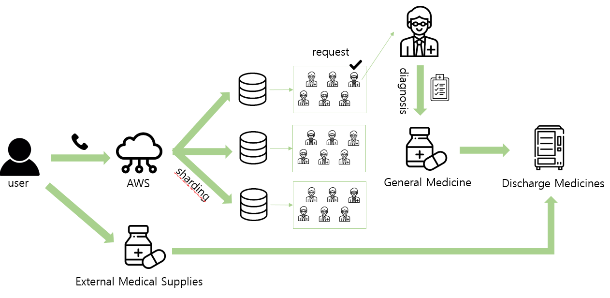
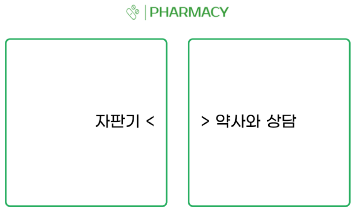
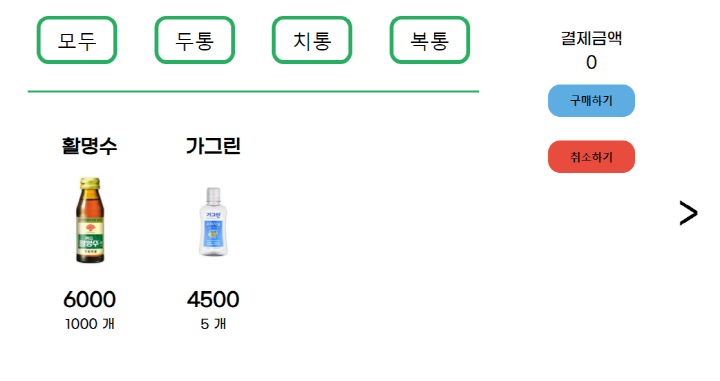

# Medicine Vending Machine

## Motivation

Many people complain about not only getting medicine at working hours but also hard to get it in underdeveloped areas.

## How it works



## Images (Examples)




## File directory tree

``` python
MedicineVendingMachine
 ┣ controllers
 ┃ ┣ admin.js
 ┃ ┣ error.js
 ┃ ┣ externalMedicalSupplies.js
 ┃ ┗ generalMedicine.js
 ┣ data
 ┣ models
 ┃ ┣ database.js
 ┃ ┣ machine.js
 ┃ ┗ order.js
 ┣ public
 ┃ ┣ css
 ┃ ┃ ┣ forms.css
 ┃ ┃ ┣ main.css
 ┃ ┃ ┗ medicine.css
 ┃ ┣ images
 ┃ ┗ js
 ┃ ┃ ┣ checkout.js
 ┃ ┃ ┣ pharmacistOrder.js
 ┃ ┃ ┣ socket.io.js
 ┃ ┃ ┗ vendingOrder.js
 ┣ routes
 ┃ ┣ admin.js
 ┃ ┣ externalMedicalSupplies.js
 ┃ ┗ generalMedicine.js
 ┣ util
 ┃ ┣ python
 ┃ ┃ ┗ main.py
 ┃ ┣ database.js
 ┃ ┗ path.js
 ┣ views
 ┃ ┣ admin
 ┃ ┃ ┗ add-medicine.ejs
 ┃ ┣ includes
 ┃ ┃ ┣ end.ejs
 ┃ ┃ ┗ head.ejs
 ┃ ┣ machine
 ┃ ┃ ┣ checkout.ejs
 ┃ ┃ ┣ index.ejs
 ┃ ┃ ┣ pharmacist.ejs
 ┃ ┃ ┣ socketIo.ejs
 ┃ ┃ ┗ vending.ejs
 ┃ ┗ 404.ejs
 ┣ app.js
 ┣ package-lock.json
 ┣ package.json
 ┗ socket.js
```

## Todo

### Hardward
- [ ] control motors
- [ ] make a frame by using a 3D printer
- [ ] complete the machine

### Software
- [x] make a User Interface
- [x] connect to AWS
- [ ] complete client-side
- [ ] complete server-side

## Reference
